# DevOps Final Project _________________________________________________________________________________________________

## End-to-end DevOps bootcamp project using Azure, Terraform, Ansible,Kubernetes, GitHub Actions, Flask, and PostgreSQL.


## Quick Reproduction Guide

### 1. Clone the repository

```bash
git clone https://github.com/SajedaSalem/k8s-devops-final-project.git
cd k8s-devops-final-project
```

### 2. Configure Terraform

Update the required Terraform variables for the local environment, including:
- Azure subscription ID
- allowed public IP
- SSH public key
- network settings if required

Then:

- cd terraform
- terraform init
- terraform fmt -check
- terraform validate
- terraform plan
- terraform apply

### 3. Configure the Kubernetes nodes with Ansible

SSH to the control-plane node as the automation user:
´´´
cd ~/k8s-devops-final-project/ansible
ansible -i inventory.ini k8s_cluster -m ping
ansible-playbook -i inventory.ini prepare-nodes.yml
ansible-playbook -i inventory.ini site.yml
´´´
Verify:
´´´
kubectl get nodes
´´´

### 4. Run the application locally with Docker Compose
´´´
cd app
docker compose up -d --build
docker compose ps
curl http://localhost:5000/ready
´´´
Optional demo data:
´´´
docker compose exec web python scripts/seed.py
´´´

### 5. Deploy the application to Kubernetes
´´´
kubectl apply -f k8s/
kubectl get pods,svc,pvc -o wide
´´´

### 6. Access the application

Using an SSH tunnel:
´´´
ssh -i ~/.ssh/k8slab_key \
  -L 30080:10.0.1.10:30080 \
  azureuser@<CP1_PUBLIC_IP>
´´´

Then browse to: http://localhost:30080


------------------------------
##  Project Status 

Completed:
- Prepared an Ubuntu 26.04 LTS environment using WSL 2 on Windows.
- Connected VS Code to the WSL environment.
- Verified Git, SSH, Python, Terraform, and Azure CLI.
- Authenticated to Azure and verified an enabled default subscription.
- Initialized the local Git repository on the main branch.
- Added .gitignore rules and an initial Terraform variables template.

Azure infrastructure has not been provisioned yet.


##  Planned Architecture 


- k8slab-cp1: Rocky Linux 9, Kubernetes control plane and Ansible controller.
- k8slab-w1: Rocky Linux 9, Kubernetes worker.
- Flask Task Tracker application with a PostgreSQL database.
- GitHub Actions for checks, tests, and container image publication to GHCR.


##  Repository Structure 

| Path | Purpose |
|------|---------|
| terraform/ | Azure infrastructure definitions |
| ansible/ | Inventory, variables, and automation playbooks |
| app/ | Application code, tests, and container configuration |
| k8s/ | Kubernetes manifests |
| docs/screenshots/ | Verification screenshots |


##  Workstation Setup 


Commands run inside Ubuntu through WSL 2:

    git --version
    ssh -V
    python3 --version
    terraform version
    az version


Azure login:

    az login --use-device-code

Subscription verification:

    az account show --query "{Name:name, State:state, Default:isDefault}" --output table

The selected subscription was enabled and set as the default.


# Task 1 _______________________________________________________________

### 1. Which files did you exclude with .gitignore , and what sensitive data would they leak if committed?

- Terraform state and saved plans: may contain sensitive resource
  attributes, configuration values, or credentials.
- Real Terraform variable files and .env files: may contain secrets
  and environment-specific settings.
- SSH private keys: could allow someone to impersonate the key owner.
- Kubernetes kubeconfig and admin.conf: may contain credentials
  granting access to the cluster.
- Crash logs: may contain sensitive diagnostic information.
- Terraform working directories, Python environments, caches, and
  coverage reports: generated local files that should not be committed.

Safe example templates are allowed and must contain no real secrets.


### 2. If a secret is committed and deleted in a later commit, is it safe? Why or why not?

No it is not safe. Earlier commits may still contain the secret, and other people may already
have copied it. An appropriate solution is to revoke the exposed secret first, then remove
it from repository history. A .gitignore rule does not erase existing Git history.


# Task 2 _______________________________________________________________


### Verification Screenshot

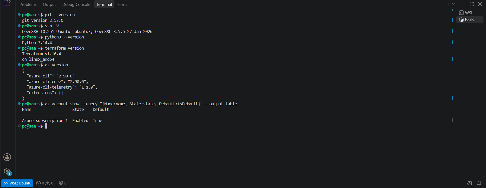


###  How does Terraform authenticate to Azure in this setup, and why is this method safer than hardcoding credentials inside .tf files?

For this local workflow, Terraform's AzureRM provider will use the Azure CLI session established with:

    az login --use-device-code

Azure CLI manages authentication tokens locally. The provider uses this authentication to request access to Azure, subject to the signed-in account's permissions.

The subscription ID identifies the target subscription. Note: it is not a password and does not grant access by itself.

This avoids embedding passwords, client secrets, or access tokens in Terraform code, where they could be exposed through a public repository and its Git history.

The local Azure CLI credential cache must also remain private.


# Task 3 _______________________________________________________________

### What happens if you run "terraform apply" before accepting marketplace terms?

Terraform may fail when trying to create the Rocky Linux virtual machines because Azure requires the Marketplace legal terms for that image to be accepted before deployment. The VM resource cannot be provisioned until those terms have been accepted for the subscription.

### Verification Screenshot

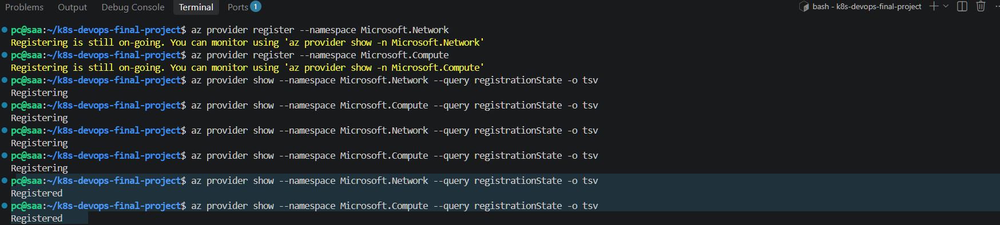

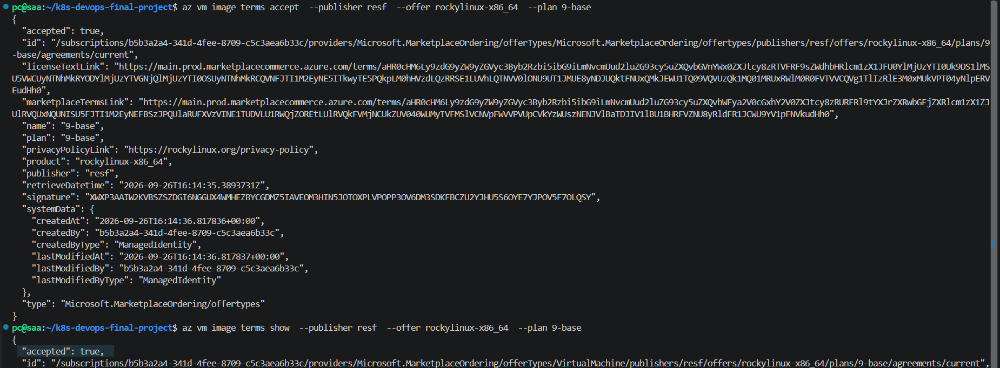


# Task 4 _______________________________________________________________


### What is the difference between a public key and a private key, and where does each reside?

The public key can be distributed to remote systems and is used to verify authentication attempts. The private key must remain secret on the local machine because it proves the user's identity. In this project, the private key stays on the laptop, while only the public key is installed on the Azure VMs.


# Task 5 _______________________________________________________________


### 1. Why does the NSG not need rules for Kubernetes traffic between cp1 and w1 inside the subnet?


Both Kubernetes nodes are connected to the same Azure virtual network and subnet. Azure allows communication within the virtual network through its default NSG rules, so additional inbound rules are not required for every internal Kubernetes port between cp1 and w1.

The custom NSG rules are mainly used to control traffic coming from outside the virtual network, such as SSH on port 22 and the Kubernetes API on port 6443.


### 2. Why must the private IPs be static for this cluster?

The Kubernetes nodes need stable addresses because the control plane and worker communicate using their private IPs. In this project:

- k8slab-cp1 uses 10.0.1.10
- k8slab-w1 uses 10.0.1.11

Using static private IPs prevents these addresses from changing after restarts or redeployments. This also keeps /etc/hosts, Ansible inventory values, and Kubernetes configuration consistent

### 3. What is stored in terraform.tfstate, and why must it never be pushed to Git?

terraform.tfstate stores Terraform's record of the real infrastructure. It contains information such as:

- Azure resource IDs
- IP addresses
- resource properties
- relationships between Terraform resources and Azure resources
- configuration values that may include sensitive information

The state file should not be committed to Git because it can expose infrastructure details and potentially sensitive values. It is therefore excluded through .gitignore.


# Task 6 _______________________________________________________________

### Verification Screenshot

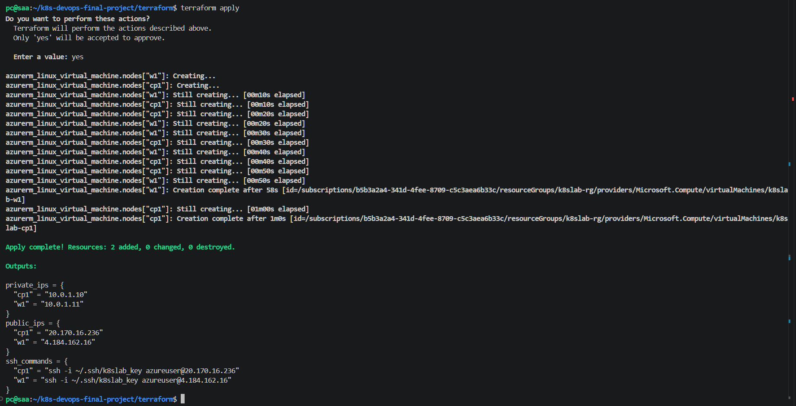

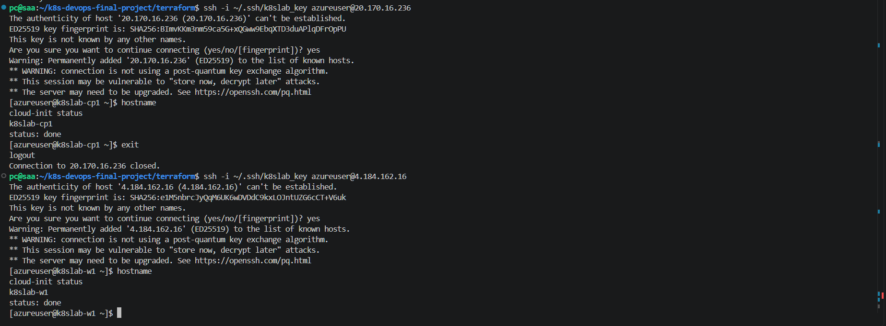


# Task 7 _______________________________________________________________


A dedicated automation user named `sajida` was created on both Kubernetes nodes.

The user was added to the `wheel` group and configured with passwordless sudo using a dedicated sudoers drop-in file.

The following commands were used on both nodes:

```bash
sudo useradd -m -s /bin/bash sajida
sudo usermod -aG wheel sajida
echo 'sajida ALL=(ALL) NOPASSWD:ALL' | sudo tee /etc/sudoers.d/sajida
sudo chmod 0440 /etc/sudoers.d/sajida
```

### Verification Screenshot

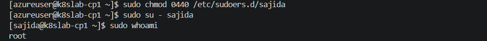

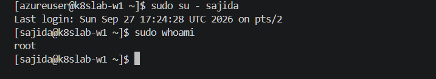


### 1. Why does the user need passwordless sudo on cp1 even though cp1 is the Ansible controller?

The Ansible controller is also one of the Kubernetes nodes and must be configured by Ansible just like the worker node.

Many configuration tasks require administrative privileges, for example:

- installing packages
- disabling swap
- configuring kernel modules
- installing Kubernetes components

Passwordless sudo allows Ansible to perform these privileged tasks automatically without stopping to ask for a password.


### 2. Why is a sudoers drop-in file safer than editing /etc/sudoers directly?

Using a dedicated file inside /etc/sudoers.d/ keeps the configuration for the automation user isolated from the main sudo configuration.

This is safer because:
- the main /etc/sudoers file remains unchanged
- the automation user's permissions can be managed separately
- the configuration can be removed easily if needed
- mistakes are less likely to affect the entire sudo configuration

The file permissions are restricted to 0440, as required.


# Task 8 _______________________________________________________________

A dedicated SSH key pair was generated on `cp1` under the automation user `sajida`.

The key was created with:

```bash
ssh-keygen -t ed25519
```

The public key from cp1 was then added to: /home/sajida/.ssh/authorized_keys on w1.

The required permissions were configured with:

```bash
chmod 700 ~/.ssh
chmod 600 ~/.ssh/authorized_keys
```

Passwordless SSH access from cp1 to w1 was verified with:


```bash
ssh k8slab-w1 hostname
```

Expected output: k8slab-w1

The command completed without prompting for a password.

### Verification Screenshot

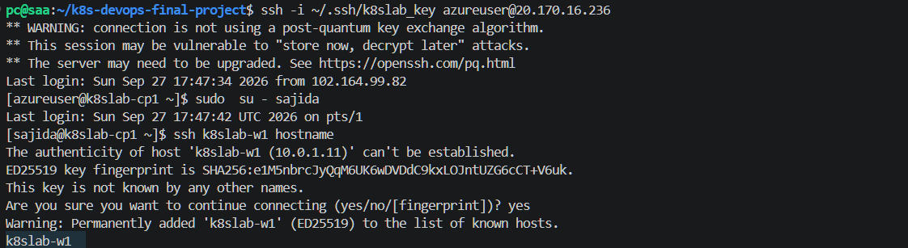


### 1. Why does ssh-copy-id fail on Azure VMs by default, and how was the key installed on w1?

Azure Linux VMs are commonly configured for SSH key authentication only, with password authentication disabled.

ssh-copy-id normally logs in to the remote machine first and then installs the public key. If password login is disabled and the new automation user does not yet have an authorized SSH key, ssh-copy-id cannot authenticate as that user.

In this project, the public key generated on cp1 was copied manually to the authorized_keys file of the sajida user on w1.
The connection to w1 was first made using the Azure administrator account and the original k8slab_key. The key was then installed under:

/home/sajida/.ssh/authorized_keys

with the correct ownership and permissions.

### 2. What happens if permissions on .ssh or authorized_keys are configured too loosely?

OpenSSH checks the permissions of SSH-related files and directories for security reasons.
If .ssh or authorized_keys is writable by other users, SSH may consider the configuration insecure and refuse to use the authorized key.

The recommended permissions are:

~/.ssh               → 700

~/.ssh/authorized_keys → 600

This ensures that only the owner can modify the SSH configuration and authorized keys.

# Task 9 _______________________________________________________________

Ansible Core was installed only on the control-plane node k8slab-cp1.
The worker node k8slab-w1 does not have Ansible installed.

### Installation

On k8slab-cp1, Ansible Core was installed with:

```bash
sudo dnf install -y epel-release
sudo dnf install -y ansible-core
```
The installation was verified with:

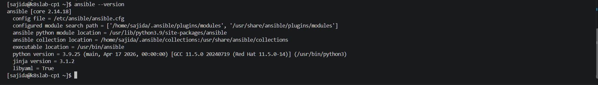

The project repository was then cloned on cp1 under the automation user's home directory:

```bash
cd ~
git clone https://github.com/SajedaSalem/k8s-devops-final-project.git
```
 
 ### Why does w1 require no Ansible software installed?

Ansible is agentless. The Ansible software runs only on the controller node, which in this project is k8slab-cp1.
The controller connects remotely to k8slab-w1 using SSH and executes Ansible modules there.
Therefore, w1 does not need Ansible installed.

It only needs:
- SSH access
- Python
- the automation user sajida
- passwordless sudo permissions

This allows cp1 to manage w1 remotely.


# Task 10 ______________________________________________________________

An Ansible inventory was created to define the Kubernetes control-plane and worker nodes.
The inventory contains:

```ini
[k8s_master]
k8slab-cp1 ansible_connection=local

[k8s_workers]
k8slab-w1 ansible_host=10.0.1.11

[k8s_cluster:children]
k8s_master
k8s_workers
```
A group variables file was created at: ansible/group_vars/all.yml
with:

```
cp1_ip: "10.0.1.10"
w1_ip: "10.0.1.11"
cluster_user: "sajida"
pod_network_cidr: "192.168.0.0/16"

ansible_user: "{{ cluster_user }}"
ansible_become: true
```
Connectivity to both nodes was verified with:
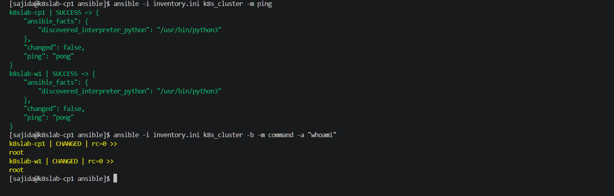


### Why is cp1 managed with ansible_connection=local instead of connecting over SSH to itself?

cp1 is the Ansible controller and is also part of the Kubernetes cluster.

Using: ansible_connection=local
allows Ansible to manage the control-plane node directly from the local machine instead of opening an unnecessary SSH connection back to itself.
This makes the configuration simpler and avoids relying on SSH for local execution.


# Task 11 ______________________________________________________________

Created the Ansible playbook: `ansible/prepare-nodes.yml`

The playbook performs the following tasks on both Kubernetes nodes:

- Updates the DNF package cache
- Upgrades installed packages
- Installs administration tools:
  - nano
  - vim
  - git
  - curl
  - wget
  - bash-completion
  - tar
  - tmux
- Installs networking and troubleshooting tools:
  - iproute
  - net-tools
  - bind-utils
  - traceroute
  - tcpdump
  - lsof
  - sysstat
- Installs Python 3 and pip
- Installs and enables chrony
- Enables and starts SSH
- Displays system information using Ansible facts
- Checks whether a reboot is required using `needs-restarting -r`
- Reboots only worker nodes when necessary
- Never automatically reboots the control-plane node


The playbook was executed with:

```bash
ansible-playbook -i inventory.ini prepare-nodes.yml
```

### Verification

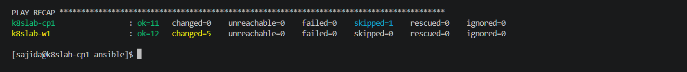

The worker node required a reboot after package updates and was automatically rebooted by Ansible. The control-plane node was intentionally not rebooted.


### What does idempotency mean in Ansible and Infrastructure as Code?

Idempotency means that repeatedly applying the same automation should bring the system to the same desired state without unnecessarily repeating changes.
For example, if a package is already installed or a service is already running, Ansible reports the task as ok instead of changing the system again.
This can be seen in the playbook output. The control-plane node had already been prepared, therefore most tasks returned:

ok

while the newly recreated worker required configuration changes and returned:

changed

This allows Infrastructure as Code to be safely executed multiple times while keeping systems consistent.


# Task 12 ______________________________________________________________

### Why can control-plane.yml and workers.yml not be swapped?

The control plane must be initialized before any worker can join the cluster.
control-plane.yml runs kubeadm init, which creates the Kubernetes control plane and generates the worker join command containing the API server address, token, and discovery information.

workers.yml depends on that generated join command.

Therefore, if workers.yml ran first, the worker would have no initialized Kubernetes API server to connect to and no valid join command to use.

# Task 13 ______________________________________________________________

For Kubernetes to run correctly, both nodes were prepared with the required Linux kernel, networking, security, and container runtime settings.

### Kubernetes Prerequisites

The playbook `ansible/prerequisites.yml` performs the following configuration on all Kubernetes nodes:

- Disables swap immediately with `swapoff -a`
- Disables swap permanently in `/etc/fstab`
- Sets SELinux to `permissive`
- Loads the required kernel modules:
  - `overlay`
  - `br_netfilter`
- Ensures the kernel modules are loaded after reboot
- Configures the required sysctl parameters:
  - `net.bridge.bridge-nf-call-iptables = 1`
  - `net.ipv4.ip_forward = 1`

Verification was performed with:

```bash
ansible -i inventory.ini k8s_cluster -b -m shell -a \
"swapon --show; getenforce; lsmod | grep -E 'overlay|br_netfilter'; \
sysctl net.bridge.bridge-nf-call-iptables; \
sysctl net.ipv4.ip_forward"
```

The result confirmed that both nodes had:

SELinux: Permissive
overlay: loaded
br_netfilter: loaded
net.bridge.bridge-nf-call-iptables = 1
net.ipv4.ip_forward = 1


### Container Runtime

The playbook ansible/containerd.yml installs and configures containerd on all Kubernetes nodes.

The playbook performs the following tasks:

Installs dnf-plugins-core
Adds the Docker CE repository
Installs containerd.io
Creates /etc/containerd
Generates the default containerd configuration
Configures containerd to use the systemd cgroup driver
Enables and starts the containerd service

The following configuration was enabled: SystemdCgroup = true

Verification confirmed that containerd was:

active
enabled

on both nodes.

### 1. Why does the Kubernetes kubelet refuse to run if swap is enabled?

Kubernetes expects the kubelet to have predictable control over node memory.

If swap is enabled, the operating system may move memory pages from RAM to disk. This makes memory usage less predictable from Kubernetes' point of view and can interfere with resource limits, scheduling, and memory-pressure decisions.

For this reason, the standard Kubernetes node setup disables swap before starting kubelet.

### 2. Why must containerd and kubelet use the same cgroup driver?

Linux cgroups are used to control and account for resources such as CPU and memory.

The kubelet manages Kubernetes workloads, while containerd manages the actual containers. Both therefore interact with the same cgroup hierarchy.

If kubelet and containerd use different cgroup drivers, they may manage resources using different cgroup structures. This can lead to inconsistent resource management and node instability.

In this project, containerd is configured with: SystemdCgroup = true
so that the container runtime uses the systemd cgroup driver expected by the Kubernetes node configuration.


# Task 14 ______________________________________________________________

The kubernetes.yml playbook configures the Kubernetes v1.36 repository and installs:

kubelet
kubeadm
kubectl

The installed version was verified as Kubernetes v1.36.5
Kubelet is enabled on both nodes and firewalld is inactive.

The control-plane.yml playbook initializes the control plane using:
´´´
kubeadm init \
  --apiserver-advertise-address=10.0.1.10 \
  --pod-network-cidr=192.168.0.0/16
´´´
The Kubernetes configuration is copied to /home/sajida/.kube/config for the automation user.
Calico v3.31.0 is then installed as the cluster Container Network Interface (CNI).


### Why is the control-plane node NotReady until Calico is installed?

kubeadm init creates the Kubernetes control plane, but it does not install a pod networking implementation. Without a CNI plugin, Kubernetes cannot configure networking between pods.Calico provides the required pod network. Once Calico is running successfully, Kubernetes networking becomes available and the node can transition to Ready.

# Task 15 ______________________________________________________________

The workers.yml playbook joins the worker node using the join command generated on the control-plane node.

The task uses:
´´´
creates: /etc/kubernetes/kubelet.conf
´´´

so an already joined worker is not unnecessarily joined again when the playbook is rerun. The entire cluster was deployed using:
´´´
ansible-playbook -i inventory.ini site.yml
´´´

The final Ansible result & Cluster status was verified with::
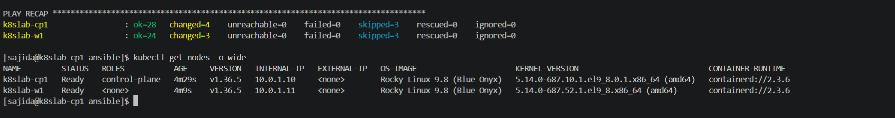


# Task 16 ______________________________________________________________


A Flask-based Task Tracker application was created with support for task priorities.

Each task contains:

- `id`
- `title`
- `completed`
- `priority`

Supported priorities are:

```text
low
medium
high
```

The default priority is medium. The priority field is implemented in:

the database model
the REST API
the web UI

### API

Tasks can be created using: ´POST /api/tasks´

Example request:
´´´
{
  "title": "Finish project",
  "priority": "high"
}
´´´

Tasks can be retrieved using: ´GET /api/tasks´

The application also provides:
´´´
/health
/ready
´´´

for health and readiness checks.

### Unit Testing

Four unit tests were implemented using pytest:

- create a task with priority
- verify default priority is medium
- reject an invalid priority
- retrieve tasks from the API

Tests were executed with:
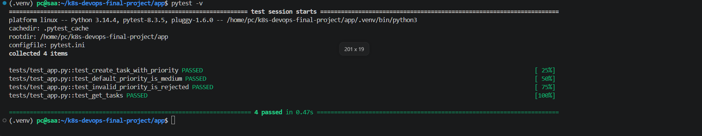


### Seed Data
A seed script was created at app/scripts/seed.py

It inserts 10 sample tasks with different priorities. The script is executed with:

´´´
PYTHONPATH=. python scripts/seed.py
´´´


### User Interface

The Task Tracker UI allows users to:

- add new tasks
- select a task priority
- view existing tasks
- distinguish priorities using visual badges
- switch between light and dark mode

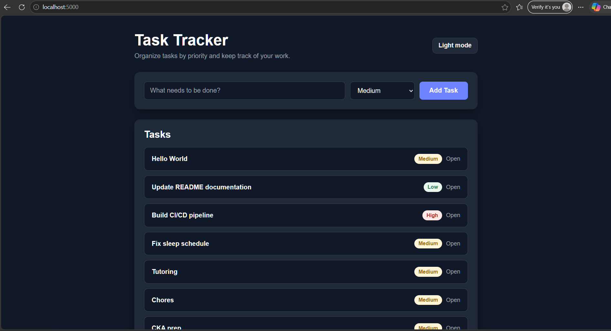

# Task 17 ______________________________________________________________

The application is containerized using a `python:3.12-slim` base image.

### Dockerfile

The Dockerfile uses:

- python:3.12-slim
- APP_VERSION as a build argument
- a non-root ´appuser´
- Gunicorn as the production application server
- port ´5000´
- dependency installation before copying the application source to improve Docker layer caching

The application runs as a non-root user to avoid giving the application unnecessary privileges inside the container.


### Docker Compose

Docker Compose starts two services:

- `web` - Flask application running with Gunicorn
- `db` - PostgreSQL 16 database

PostgreSQL uses a named Docker volume:

```text
postgres_data
```

### Persistence Test

A task was created through the application and Docker Compose was restarted:
´´´
docker compose restart
´´´
After the restart, the task was still present, confirming that PostgreSQL data is persisted using the Docker volume.


### 1. What is the advantage of using a slim Python base image compared to a standard image?

A slim base image contains only the essential packages needed to run the application.

This gives several advantages:

- smaller Docker image size
- faster image downloads and deployments
- less storage usage
- smaller attack surface because fewer unnecessary packages are installed

### 2. What is the operational difference between the /health and /ready endpoints?


A health check determines whether the application process is still alive and running.
A readiness check determines whether the application is actually ready to handle requests.

For this application:

- `/health` checks that the Flask application is running.
- `/ready` also checks whether the application can communicate with the database.

This means the application can be healthy but not ready. For example, Flask may still be running while PostgreSQL is temporarily unavailable.


### Verification
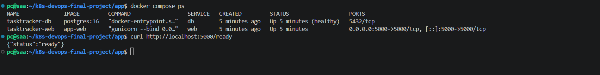


# Task 18 ______________________________________________________________

A GitHub Actions workflow was created at:

```text
.github/workflows/ci-cd.yml
```

The pipeline contains three stages:

1. Lint and Unit Tests
- Python 3.12
- flake8
- pytest

2. Terraform Validation
- terraform init
- terraform fmt -check
- terraform validate

3. Docker Build and Push
- builds the Task Tracker image
- authenticates to GitHub Container Registry using GITHUB_TOKEN
- pushes the image to GHCR
- creates both a commit-SHA tag and the latest tag on pushes to main

Published image:
´´´
ghcr.io/sajedasalem/task-tracker:latest
´´´

### Verification
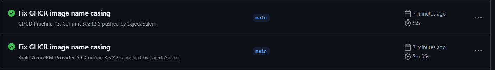
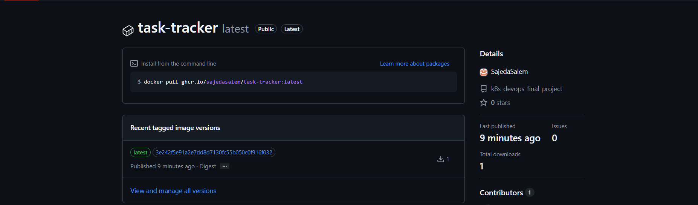


# Task 19 ______________________________________________________________

The Task Tracker application and PostgreSQL database are deployed to the Kubernetes cluster using manifests under: k8s/

The deployment includes:

- PostgreSQL 16 Deployment
- PostgreSQL ClusterIP Service
- Kubernetes Secret for database credentials
- PersistentVolume
- PersistentVolumeClaim
- Task Tracker Deployment using the image from GHCR
- Task Tracker NodePort Service
- readiness probe using /ready
- liveness probe using /health


The Task Tracker connects to PostgreSQL using the Kubernetes DNS name:
´´´
postgres.default.svc.cluster.local
´´´

The application image is:
´´´
ghcr.io/sajedasalem/task-tracker:latest
´´´

The application is exposed internally using NodePort: 30080

For secure testing from the local workstation, an SSH tunnel can be used:
´´´
ssh -i ~/.ssh/k8slab_key \
  -L 30080:10.0.1.10:30080 \
  azureuser@<CP1_PUBLIC_IP>
´´´

The UI is then available at: http://localhost:30080


### Azure Calico Networking

The default Calico installation used IP-in-IP encapsulation.
Cross-node pod communication failed in Azure, including DNS requests from pods on the worker node to CoreDNS running on the control-plane node.

The Calico IPPool was changed to:
´´´
ipipMode: Never
vxlanMode: Always
´´´

The same configuration is included in the Ansible automation so a newly created Azure cluster receives the correct networking configuration automatically.

### Verification
´´´
kubectl get pods,svc,pvc -o wide
kubectl get ippool default-ipv4-ippool -o yaml
curl http://10.0.1.10:30080/health
curl http://10.0.1.10:30080/ready
´´´


### Verification


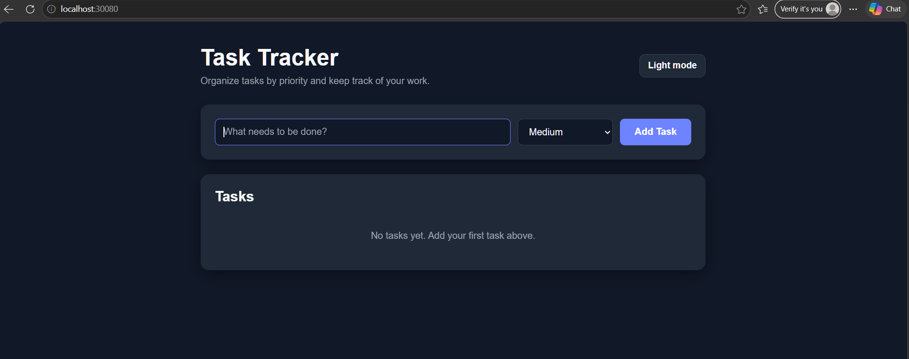
-------------------------------------------------------
##Bonus2
Remote `kubectl` access was configured so that the Kubernetes cluster can be managed directly from the local workstation instead of logging in to the control-plane node first.

The Kubernetes administrator configuration was copied from `cp1` to the laptop:

```bash
mkdir -p ~/.kube

ssh -i ~/.ssh/k8slab_key azureuser@<CP1_PUBLIC_IP> \
  'sudo cat /etc/kubernetes/admin.conf' \
  > ~/.kube/k8slab-config
```

Because the Kubernetes API server uses the private control-plane address, the kubeconfig was updated to connect through localhost:
´´´
sed -i 's#https://10.0.1.10:6443#https://127.0.0.1:6443#' \
  ~/.kube/k8slab-config
´´´

The TLS server name was kept as the Kubernetes control-plane hostname:
´´´
kubectl --kubeconfig ~/.kube/k8slab-config config set-cluster kubernetes \
  --server=https://127.0.0.1:6443 \
  --tls-server-name=k8slab-cp1
´´´

An SSH tunnel was then created from the laptop to the Kubernetes API server:
´´´
ssh -i ~/.ssh/k8slab_key \
  -N \
  -L 6443:10.0.1.10:6443 \
  azureuser@<CP1_PUBLIC_IP>
´´´

With the tunnel running, the cluster can be managed directly from the laptop:
´´´
KUBECONFIG=~/.kube/k8slab-config kubectl get nodes
´´´

The command successfully returned both Kubernetes nodes as Ready, confirming that remote cluster administration from the workstation was working.
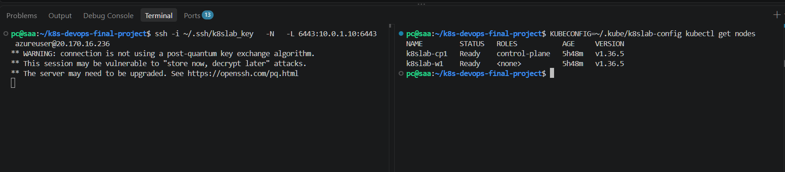


-----------------------------------------------------
```markdown
## Real Engineering Post-Mortems

### Engineering Post-Mortem 1: Terraform Download Failure

### Error
Terraform downloads and requests to HashiCorp's release and APT endpoints returned HTTP 404.

### Cause
The response included " x-amzn-waf-reason: geo ", and the browser reported that the content was unavailable in the current region.

### Fix
Installed Terraform through the Snap Store using the community-maintained Snapcrafters package:

    sudo snap install terraform --classic

This package is not officially maintained by HashiCorp. Classic confinement permits broader access than a strictly confined Snap.

### Verification

    terraform version

Result: Terraform v1.16.4 on linux_amd64.

This resolved the CLI installation. Access to Terraform provider downloads has not yet been verified.


### Engineering Post-Mortem 2: HashiCorp Registry Unavailable

### Error
`terraform init` failed because Terraform could not retrieve the `hashicorp/azurerm` provider from `registry.terraform.io`.


### Cause
HashiCorp services were not available from my current region. The HashiCorp API also returned a message stating that the content was not available in the region.


### Fix
I used GitHub Actions to build the official hashicorp/azurerm provider from the HashiCorp source code. I then downloaded the compiled provider binary and configured a local Terraform filesystem mirror through ~/.terraformrc.

Terraform was then able to initialize successfully using:

  terraform init


### Engineering Post-Mortem 3 - Worker Node Became Unresponsive

### Error  
`k8slab-w1` became unreachable by SSH and Ansible. Azure still showed the VM as running, but the VM Agent status was:

```text
ProvisioningState/Unavailable
Not Ready
VM Agent is unresponsive
```

### Cause:
The worker VM itself became unhealthy. A normal restart and Azure redeploy did not recover the guest OS/VM Agent.

### Fix:
The worker VM was replaced with Terraform using:
terraform plan -replace='azurerm_linux_virtual_machine.nodes["w1"]'

Only the VM was recreated, while the existing NIC and static IP addresses remained unchanged.

After recreation, the VM Agent returned Ready, SSH access was restored, and Ansible connectivity worked again.

### Lesson Learned:
A VM can still appear as running in Azure while the guest OS or VM Agent is unhealthy. VM health should therefore be checked using SSH, VM Agent status, and Ansible connectivity, not only the cloud power state.


### Post-Mortem 4 - Kubernetes Pods Could Not Reach CoreDNS

### Error: The Task Tracker pods entered `CrashLoopBackOff` because the PostgreSQL hostname could not be resolved. A DNS test from the worker returned:

```text
connection timed out; no servers could be reached
```

### Cause: Calico was configured with IP-in-IP encapsulation:

´´´
ipipMode: Always
vxlanMode: Never
´´´

Cross-node pod networking did not function correctly in the Azure environment.

### Fix: The Calico IPPool was changed to VXLAN:
´´´
ipipMode: Never
vxlanMode: Always
´´´

After the change, worker-node pods could reach CoreDNS and Kubernetes service discovery worked correctly. The fix was then added to the Ansible automation.

### Lesson: 
CNI configuration must match the networking capabilities of the underlying cloud platform. A Kubernetes component may appear healthy while cross-node networking is still broken.